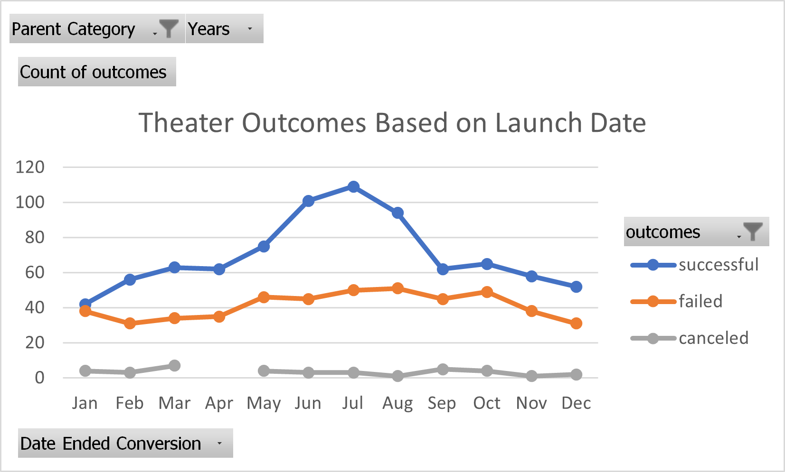
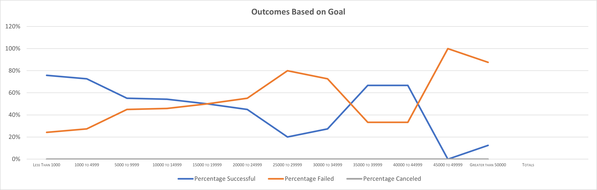

# Kickstarting with Excel

## Overview of Project

### Purpose

We started this project to help an up-and-coming playwright, Louise, who wants to start a crowdfunding campaign to help fund her new play 'Fever'. She's estimating a budget of over $10,000. We used Excel to organize, sort, and analyze crowdfunding data to determine whether there are specific factors that makes a project's campaign successful.

### Analysis and Challenges

  Two analyses were performed for Louise. The first shows theater crowdfunding results based on the launch date of the campaign. The second shows outcomes based on the crowdfunding goals.

### Analysis of Outcomes Based on Launch Date

  For this analysis, we created a pivot table showing the count of outcomes as values, Date Ended Conversion (months) as rows, and outcomes as columns. There were filters for Parent Category and years. This table was used to create a Line Chart. The line chart shows the bump in success rate during the summer months.

  

### Analysis of Outcomes Based on Goals

  For this analysis, we extracted a smaller data set from the Kickstarter data, which showed success vs. fail vs. cancel outcomes based on goal amounts. This data set was used to create a Line Chart which clearly shows the inverse relation between success rate and failure rate, as shown below.

  

### Challenges and Difficulties Encountered

  There were no challenges encountered. Possble challenges include:

  * Bad, incomplete, or poorly formatted data
  * Data that produced inconclusive results, or that showed that Louise would not be able to achieve her crowdfunding goals for her play.

## Results

- What are two conclusions you can draw about the Outcomes based on Launch Date?

  1) Crowdfunding efforts launched between May and September were most successful, with June through August the best months.

  2) It also shows that cancelled crowdfunding efforts for Theater projects were not very dependent on Launch Date.

- What can you conclude about the Outcomes based on Goals?

  1) Small goals were successful, but descreasingly so as prices increased up to around $24,999. Then fell off, only to increase sharply between $35,000 to $44,999. Above that amount, the success rate dropped off.

  2) It appears that the failure rate was the inverse of the success rate, which is expected.

- What are some limitations of this dataset?

  1) There were significant outliers in the data which prevented the "color scales" conditional formatting to produce any noticeable color gradient.

  2) It was pretty big, so uploading results to GitHub was a problem.

- What are some other possible tables and/or graphs that we could create?

  There are a lot of possibilities, but I don't know how relevant they are.
  * Success vs. fail, correlated with which restaurants are near the venue?
  * Same as above, correlated with which movies were also showing at the time?
  * I'm not sure how the photography or technology categories are relevant, but those could be explored to see if they have an impact on Louise's results.
